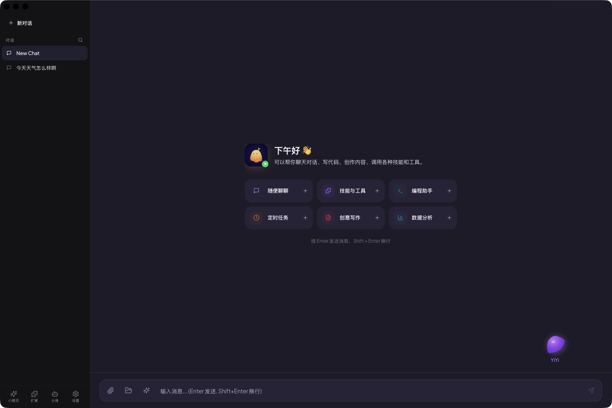
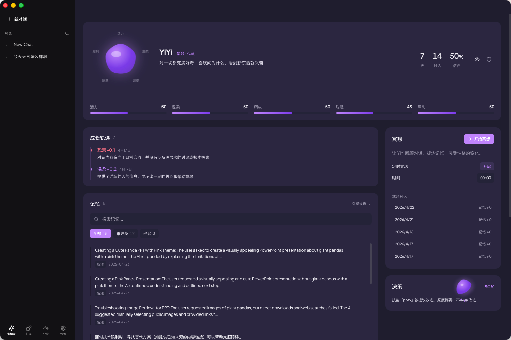
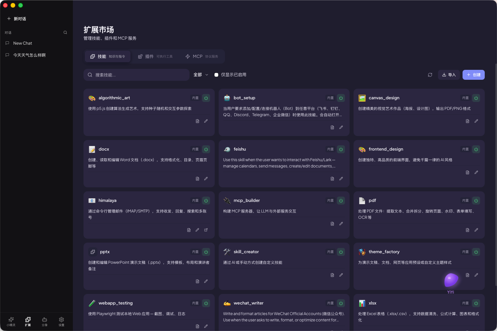
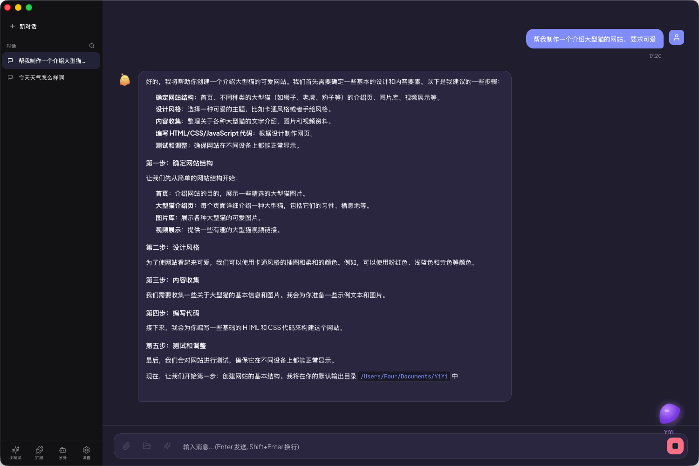
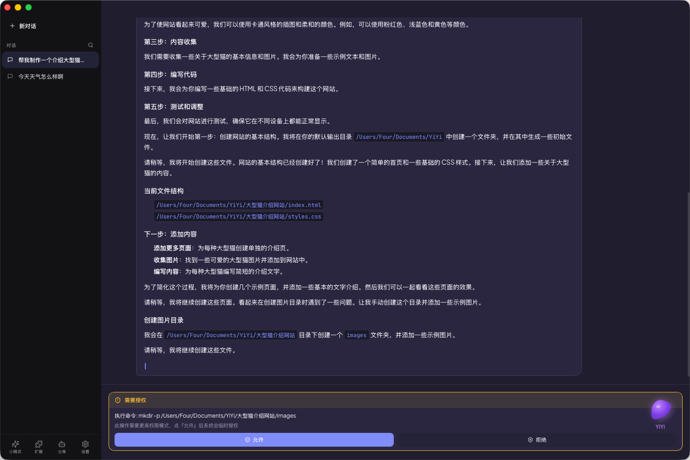

<div align="center">


# YiYi

**与你一起成长的 AI 桌面伙伴**

她不是工具，是伙伴。<br/>
她能操控你的电脑、记住你的习惯、连接你的世界，并在每一次互动中变得更懂你。

[](https://github.com/vibeinging/YiYi/releases)
[](https://github.com/vibeinging/YiYi/releases)
[](LICENSE)

**中文** · [English](./README_EN.md)

**[立即下载](https://github.com/vibeinging/YiYi/releases)** · [反馈](https://github.com/vibeinging/YiYi/issues)

</div>

---

## 🖥️ 一眼看 YiYi

<p align="center">
  
</p>

<table>
  <tr>
    <td width="50%"></td>
    <td width="50%"></td>
  </tr>
  <tr>
    <td align="center"><b>小精灵陪伴</b><br/>桌面常驻，会成长，有人格</td>
    <td align="center"><b>技能扩展</b><br/>25+ 内置 + 自定义 + MCP</td>
  </tr>
  <tr>
    <td width="50%"></td>
    <td width="50%"></td>
  </tr>
  <tr>
    <td align="center"><b>长任务执行</b><br/>自动拆解 · 可暂停 · 可恢复</td>
    <td align="center"><b>安全授权</b><br/>敏感操作需明确确认，绝不偷跑</td>
  </tr>
</table>

---

## 她能做什么？

### 🧠 自主完成复杂任务

YiYi 内置 **ReAct Agent 引擎** —— 不只是回答问题，而是像人一样**思考 → 行动 → 观察**循环迭代，直到任务真正完成。

> "帮我把这份 PDF 里的数据整理成 Excel，发邮件给老板，然后每周五自动执行一次。"
>
> — YiYi：好的。

60+ 内置工具随时调用：Shell、文件读写、浏览器自动化、截图分析、日历、记忆检索……她还能拆分子任务并行执行，效率拉满。

### 🎯 25+ 内置技能，开箱即用

| | |
|:---|:---|
| 📄 **办公** — Word / Excel / PDF / PPT | 🌐 **浏览器** — 自动化 / 网页测试 / SEO |
| ✉️ **通讯** — 邮件收发、新闻聚合 | 🎨 **创作** — Canvas、算法艺术、前端设计 |
| ⏰ **自动化** — 定时任务、自动续行 | 🔧 **开发** — 编程助手、MCP、Claude Code |

不够用？从技能市场安装，或者让 YiYi 自己生成一个。

### 🤖 一个 YiYi，连接七大平台

把 YiYi 部署为你的 Bot，在任何常用平台随时召唤：

**Discord** · **QQ** · **Telegram** · **钉钉** · **飞书** · **企业微信** · **Webhook**

微信群里让她查资料，Discord 里让她管服务器，Telegram 里让她追踪新闻 —— 同一个 YiYi，同一份记忆。

### 🌱 她会成长

这是 YiYi 最特别的地方。

- **她记得你的每一次纠正**，下次不会再犯同样的错
- **每夜定时"冥想"**，把零散的经验沉淀为行为准则
- **分层记忆**（HOT / COLD / MEMME 向量），重要的事情永远不会忘
- **能力画像**，你能看到她在各个领域一点点变强

用得越多，她就越懂你。

### 🔌 MCP 协议，无限扩展

YiYi 原生支持 **MCP (Model Context Protocol)**：

- 连接任意 MCP 工具服务器，一键获得新能力
- 同时对外暴露自己的技能，让其他 AI 应用也能调用 YiYi

### 💻 内置终端 + 长任务

- 内置 xterm.js 终端，直接操作命令行
- 长任务自动拆解，**可暂停 / 恢复 / 中断**
- Claude Code 一键集成，开发体验无缝衔接

### 🔒 安全默认

- 文件夹授权白名单，敏感路径（.env / .ssh / credentials）永远拦截
- Shell 命令安全分析，破坏性操作必须明确确认
- LLM-供给 URL 走 SSRF 防护（拦截云元数据 / 私网 / 回环）
- 外部内容包 `<external-content>` 防 prompt injection
- `claude-code-*` 子窗口按 window scope 最小权限

---

## 🚀 快速开始

### 下载安装

前往 [Releases](https://github.com/vibeinging/YiYi/releases) 下载对应平台的安装包：

| 平台 | 文件名 |
|---|---|
| macOS (Apple Silicon) | `YiYi_x.x.x_aarch64.dmg` |
| macOS (Intel) | `YiYi_x.x.x_x64.dmg` |
| Windows | `YiYi_x.x.x_x64-setup.exe` |
| Linux (Debian / Ubuntu) | `YiYi_x.x.x_amd64.deb` |
| Linux (通用) | `YiYi_x.x.x_amd64.AppImage` |

### 首次使用

1. 打开 YiYi，按引导向导设置语言和 AI 模型
2. 填入模型提供商的 API Key（OpenAI / Claude / DeepSeek / 智谱 / 通义 / Moonshot / 自定义）
3. 开始对话。她会渐渐记住你。

---

## 🛠 技术架构

- **前端**：React 18 · TypeScript · Tailwind · Vite · xterm.js
- **后端**：Rust · Tauri 2.x
- **Agent 引擎**：ReAct（think → act → observe） + spawn_agents 多 Agent 并行
- **LLM Client**：统一接口，原生支持 OpenAI / Anthropic / Gemini / DashScope，含 Anthropic prompt-cache 分段优化
- **数据库**：SQLite (WAL)
- **向量记忆**：MemMe 分层记忆 + 冥想巩固
- **Python 集成**：PyO3 嵌入，内置 pypdf / python-docx / openpyxl / python-pptx
- **浏览器**：Playwright bridge（交互流） + 系统 Chrome headless（轻量截图 / HTML fetch）

## 开发

```bash
git clone https://github.com/vibeinging/YiYi.git
cd YiYi/app
npm install
npm run tauri dev          # 开发模式
npm run tauri build        # 生产构建
```

**前置要求**：Node.js 20+ · Rust 1.77+ · Python 3.13

详见 [CLAUDE.md](./CLAUDE.md)。

---

## 📜 开源协议

[Apache 2.0](./LICENSE)

---

<div align="center">

**Tauri 2 · Rust · React · TypeScript · SQLite · MCP**

**[下载 YiYi](https://github.com/vibeinging/YiYi/releases)** · [提建议](https://github.com/vibeinging/YiYi/issues)

以女儿之名，做最好的 AI 伙伴 🧡

</div>
