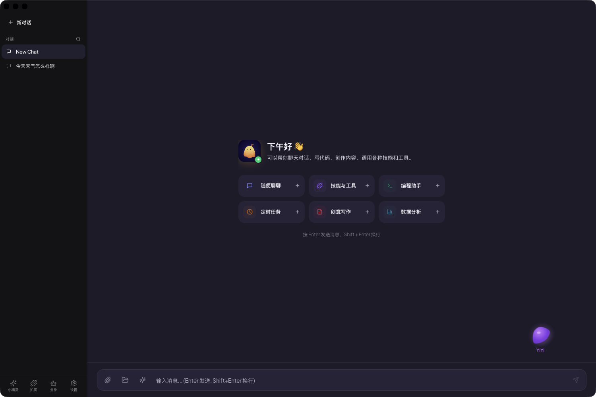
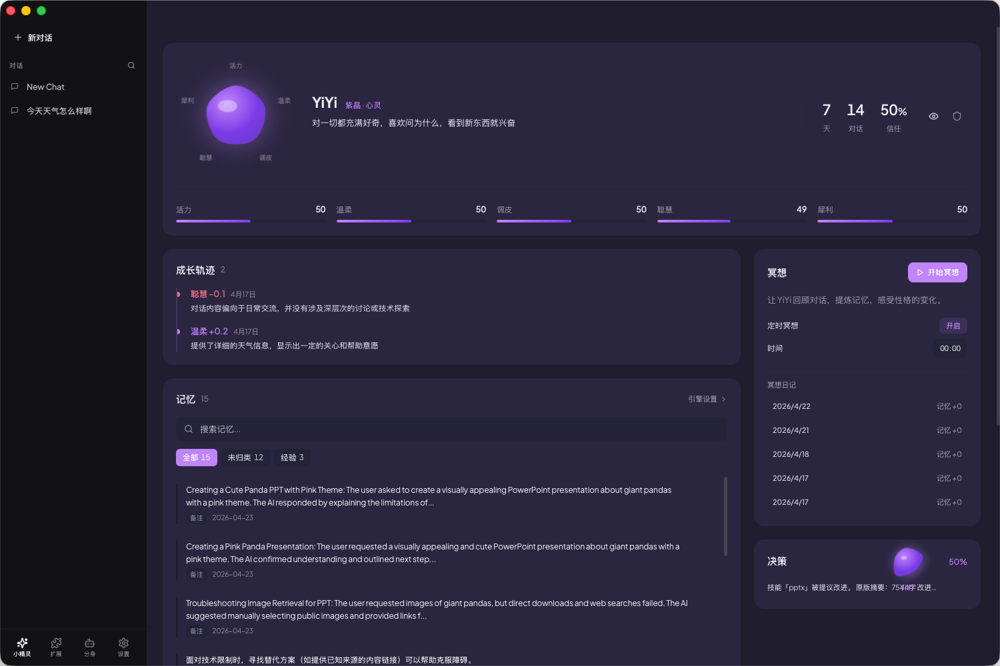
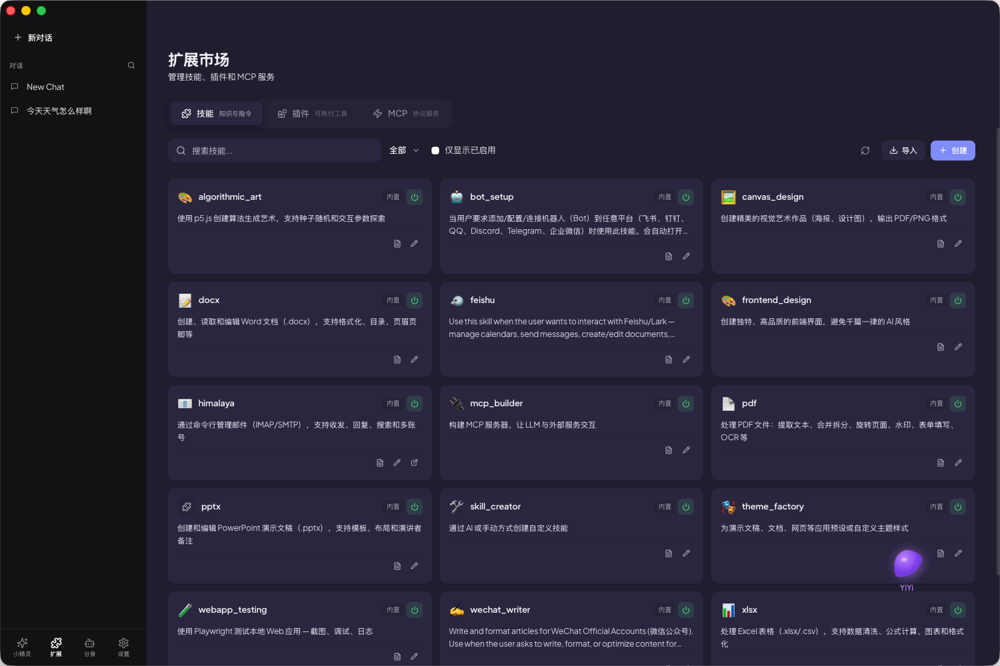
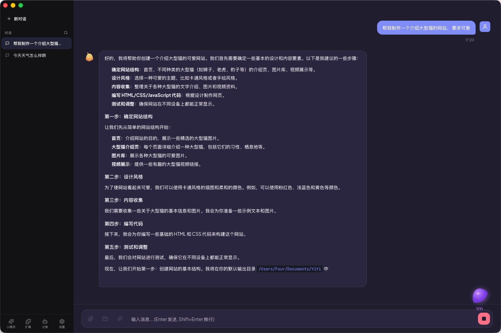
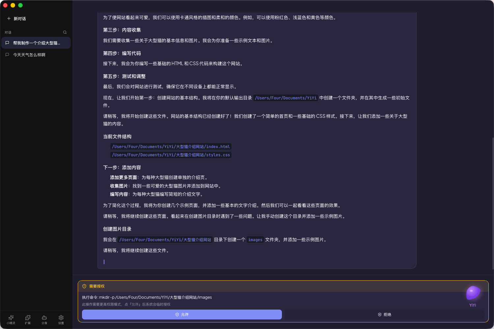

<div align="center">


# YiYi

桌面 AI 助手。只接 DeepSeek V4，但接到工程深处。会记事、会复盘，时间久了越用越顺手。

[](https://github.com/vibeinging/YiYi/releases)
[](https://github.com/vibeinging/YiYi/releases)
[](LICENSE)

中文 · [English](./README_EN.md)

[下载](https://github.com/vibeinging/YiYi/releases) · [反馈](https://github.com/vibeinging/YiYi/issues)

</div>

---

## YiYi 是什么

一个常驻桌面的 AI 助手——能动手处理事（读 PDF、写脚本、整理表格、收发邮件、定时任务、跨平台 bot），也是一个能在长期开着的窗口里共处的伙伴：记得你的偏好，记得你过往的纠正，每夜复盘当天的交互慢慢变得更懂你。

YiYi 不做"什么模型都能接"的通用产品。它只对接 DeepSeek 当代性价比最高的模型。这是一个有意识的取舍——当模型选择被收敛，适配就能做到工程深处：prefix 缓存、并行工具调用、错误码退避策略、思考链 UI、视觉能力路由。这些事情藏在多模型抽象层之下时，做不彻底也做不到位。

至于"长期开着、慢慢成长"这条线——白天纠正、夜里复盘、隔日生效——它需要模型够好顶住主循环，也需要算力便宜到不至于让人心疼，让 YiYi 在后台持续思考自己。这两点在 V4 这一代上同时成立了。

## 一眼看 YiYi

<p align="center">
  
</p>

<table>
  <tr>
    <td width="50%"></td>
    <td width="50%"></td>
  </tr>
  <tr>
    <td align="center">小精灵<br/>桌面常驻，会成长，有人格</td>
    <td align="center">技能库<br/>25+ 内置 + 自定义 + MCP</td>
  </tr>
  <tr>
    <td width="50%"></td>
    <td width="50%"></td>
  </tr>
  <tr>
    <td align="center">长任务<br/>自动拆解 · 可暂停 · 可恢复</td>
    <td align="center">授权<br/>敏感操作要明确确认</td>
  </tr>
</table>

---

## DeepSeek V4 适配做了什么

**性能与成本**

| 项目 | 做法 |
|---|---|
| Pro / Flash 路由 | 主循环走 V4 Pro；压缩、冥想、心跳、连接测试走 V4 Flash。流程级路由，省约 10× 成本 |
| Prefix Cache 命中 | tools 数组按名排序保证字节稳定；system prompt 拆静态/动态块。命中率实时显示 |
| 长上下文压缩 | 触发阈值 80% 窗口（800K）；500K 以下主动禁用压缩，避免破坏 prefix cache |
| 错误码特化 | 503 + Server busy → 5s 起步退避；402 → 提示去 platform.deepseek.com 充值；429 + 余额关键词 → 不重试 |
| Flash 加速工具 | `compact_context` 压长文、`parallel_analyze` N 个 Flash 并发，繁重子任务从 Pro 卸载到 Flash |

**体验**

| 项目 | 做法 |
|---|---|
| 思考链 | reasoning_content 流式渲染、可折叠回看、历史持久化；effort 在 OFF / HIGH / MAX 之间切换 |
| 中文思考 | system prompt 显式要求 thinking 也用中文，不再英文思考再翻译 |
| 并行工具调用 | OpenAI 兼容请求显式 `parallel_tool_calls: true` + prompt 引导一次调多个独立查询；引擎层 `join_all` 并行 |
| 缓存命中徽章 | 每条回复底部一行：`↑12,453  ↓1,028  缓存命中 73%`，让你看见省了多少 |

**鲁棒性**

| 项目 | 做法 |
|---|---|
| 反鬼打墙 | 同 (tool, args) 调用 3 次自动 block；同工具失败 8 次中文友好 halt（不再粘 raw `Error:` 给用户） |
| Browser Fetch | 真实 Chrome 131 UA、关闭 webdriver 标识；Cloudflare/Akamai 挑战页识别后明确返回 Error 引导切 web_search |
| 工作区时光机 | 每个 turn 前后 shadow-git 快照（不动你的 `.git`），任意一步可一键回滚 |

---

## 长期成长

桌面 Agent 套壳解决"一次任务"，但每开新会话都从零开始。YiYi 的另一条主线是把模型放在你的工作流里持续变强。

- **每夜冥想**：后台 Flash 模型复盘当日交互，把零散经验沉淀成行为准则
- **分层记忆**：HOT（活跃上下文）/ COLD（SQLite 持久）/ MEMME（向量召回）三层，按时效和重要度分流
- **纠正即学习**：你说一次"以后别这么做"，写进 feedback memory，下次自动避开
- **能力画像**：哪些领域变强、变弱，可视化看得见
- **失败反思**：tool 连续失败、loop_guard 触发都会写 reflection；下次同类任务先翻反思笔记

这条线需要模型一直在后台思考自己——纠正、反思、巩固——所以必须便宜到能放着不管。这是 YiYi 选择 V4 的另一个理由。

---

## 关于钱

YiYi 不收订阅费。你支付的是它代你跑事所用的算力——直接付给 DeepSeek，按用量算钱。

实际感受：

- **充值在 app 里一步完成**：余额不够时点提示，弹出 DeepSeek 官方充值页（沙盒 webview，登录态走他们家的，不走 YiYi 后台）
- **余额、用量随时能看**：每条回复底下一行能看到这次花了多少；账户页有总余额和近期消耗
- **日常聊天，1 元能用很久**：因为模型选得便宜、引擎做了缓存复用、后台轻活全走 Flash。具体多久取决于你怎么用——闲聊几小时、写代码几十次都很正常
- **不用懂"model""token"这些词**：YiYi 自己决定何时用重模型、何时用轻模型，你只管说话

---

## 主要功能

**ReAct Agent 引擎**

think → act → observe 循环。60+ 内置工具：Shell、文件读写、浏览器自动化、截图分析、日历、记忆检索等。能拆子任务并行执行。

**25+ 内置技能**

| | |
|:---|:---|
| 办公 — Word / Excel / PDF / PPT | 浏览器 — 自动化 / 网页测试 / SEO |
| 通讯 — 邮件、新闻聚合 | 创作 — Canvas、算法艺术、前端设计 |
| 自动化 — 定时任务、自动续行 | 开发 — 编程助手、MCP、Claude Code |

不够用就从技能市场装，或让 YiYi 自己生成。

**多平台 Bot**

部署成 Bot 接入：QQ · 钉钉 · 飞书 · 企业微信 · Discord · Telegram · Webhook。同一个 YiYi、同一份记忆。

**MCP 协议**

连接任意 MCP 服务器获得新能力，也对外暴露自己的技能给其他 AI 应用调用。

**安全默认**

- 文件夹白名单授权，敏感路径（.env / .ssh / credentials）始终拦截
- Shell 命令静态分析，破坏性操作要明确确认
- LLM-提供 URL 走 SSRF 防护
- 外部内容用 `<external-content>` 包裹防 prompt injection

---

## 快速开始

去 [Releases](https://github.com/vibeinging/YiYi/releases) 下载安装包：

| 平台 | 文件名 |
|---|---|
| macOS (Apple Silicon) | `YiYi_x.x.x_aarch64.dmg` |
| macOS (Intel) | `YiYi_x.x.x_x64.dmg` |
| Windows | `YiYi_x.x.x_x64-setup.exe` |
| Linux (Debian / Ubuntu) | `YiYi_x.x.x_amd64.deb` |
| Linux (通用) | `YiYi_x.x.x_amd64.AppImage` |

打开后按引导设置语言，到 [DeepSeek 平台](https://platform.deepseek.com/api_keys) 申请 API Key 粘贴进去，开始对话。Pro / Flash 路由系统自动决定，不用手动选。

> 本版本只支持 DeepSeek V4。仍在用 OpenAI / Claude / Gemini 的，请保留旧版或先导出会话再升级。

---

## 技术架构

- 前端：React 18、TypeScript、Tailwind、Vite、xterm.js
- 后端：Rust、Tauri 2.x
- Agent：ReAct + spawn_agents 多 Agent 并行 + loop_guard 反鬼打墙
- LLM：DeepSeek V4 Pro / Flash 双模型，`UsageSource` 驱动路由，prefix 缓存命中率追踪，思考流式渲染
- 成本：`engine/pricing.rs` V4 价格表（含 V4 Pro 75% 折扣到 2026-05-31）；进程级 cost side-channel 汇总后台调用
- 上下文：800K 触发自动压缩，500K 以下禁用以保护 prefix cache
- 工作区：shadow-git 快照（每 turn 前后），不动用户 `.git`
- 数据库：SQLite (WAL)
- 向量记忆：[MemMe](https://github.com/vibeinging/MemMe) 分层记忆 + 冥想巩固
- Python：PyO3 嵌入，自带 pypdf / python-docx / openpyxl / python-pptx
- 浏览器：Playwright bridge 跑交互流；系统 Chrome headless 跑轻量截图 / HTML fetch（含反爬硬化）

## 开发

```bash
git clone https://github.com/vibeinging/YiYi.git
cd YiYi/app
npm install
npm run tauri dev          # 开发模式
npm run tauri build        # 生产构建
```

依赖：Node.js 20+、Rust 1.77+、Python 3.13。详见 [CLAUDE.md](./CLAUDE.md)。

---

## 协议

[Apache 2.0](./LICENSE)

---

<div align="center">

Tauri 2 · Rust · React · TypeScript · SQLite · MCP · DeepSeek V4

[下载](https://github.com/vibeinging/YiYi/releases) · [反馈](https://github.com/vibeinging/YiYi/issues)

</div>
