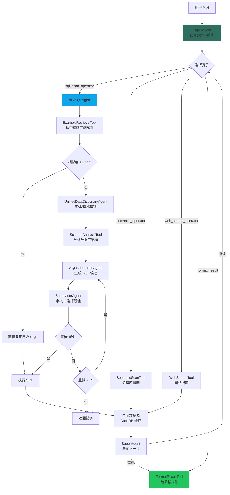

# 智能问数 Agent 设计文档

> **版本**: 3.0
> **更新日期**: 2026-03-13
> **架构**: SuperAgent 统一协调 + NL2SQLAgent 子流程

## 概述

智能问数是 YiW 最核心的数据查询能力。通过 **SuperAgent** 作为顶层协调器，统一管理结构化数据（SQL）、非结构化数据（语义搜索）和网络搜索等多种数据源。SuperAgent 内部通过 NL2SQLTool 调用 **NL2SQLAgent**，完成自然语言到 SQL 的转换。

### 核心特性

- 🎯 **SuperAgent 统一协调**: 支持 SQL、语义搜索、网络搜索等多种算子
- 🔄 **智能重试**: SQL 生成失败后自动分析和重试，最多 5 次
- ⚡ **精确匹配缓存**: 相似度 ≥ 0.99 时直接复用历史 SQL
- 🛡️ **业务规则导向**: 所有规则从 AgentSettings 动态获取
- 🤝 **Ask User 支持**: 实体歧义时请求用户澄清
- 📊 **中间数据源**: DuckDB 支持多步查询的中间结果存储
- 🌐 **混合查询**: 同时支持数据库、知识库和网络搜索

---

## 1. 系统架构

### 1.1 双层架构

智能问数采用双层架构：

| 层级 | Agent | 职责 |
|------|-------|------|
| **协调层** | SuperAgent | 任务分解、多算子编排、中间结果管理 |
| **执行层** | NL2SQLAgent | NL→SQL 转换、实体识别、SQL 生成与审核 |

### 1.2 SuperAgent 工具清单

| Tool | 名称 | 职责 |
|------|------|------|
| `sql_scan_operator` | NL2SQLTool | 自然语言转 SQL 查询 |
| `semantic_operator` | SemanticScanTool | 知识库语义搜索 |
| `semantic_join_operator` | SemanticJoinTool | 跨表语义关联 |
| `grep_datasource` | GrepDataSourceTool | 数据源探索 |
| `web_search_operator` | WebSearchTool | 网络搜索 |
| `format_result` | FormatResultTool | 结果格式化 |

### 1.3 NL2SQLAgent 子组件

| 组件 | 类型 | 职责 |
|------|------|------|
| UnifiedDataDictionaryAgent | 子 Agent | 实体/指标识别 |
| SQLGenerationAgent | 子 Agent | 生成 SQL 候选 |
| SupervisorAgent | 子 Agent | SQL 质量审核 |
| ExampleRetrievalTool | Tool | 历史样例召回 |
| SchemaAnalysisTool | Tool | 数据库 Schema 分析 |

### 1.4 执行流程图



---

## 2. SuperAgent 详解

### 2.1 任务编排

SuperAgent 通过 LLM 推理决定调用哪些算子，支持多步编排：

```python
# SuperAgent 任务解析
# LLM 输出包含编排任务列表
orchestration_tasks = [
    {"task_id": 1, "tool": "sql_scan_operator", "params": {"query": "..."}},
    {"task_id": 2, "tool": "semantic_operator", "params": {"query": "..."}},
    {"task_id": 3, "tool": "format_result", "depends_on": [1, 2]}
]
```

### 2.2 配置参数

```python
class SuperAgent(BaseAgent):
    max_iterations = 50        # 最大迭代次数
    max_empty_results = 3      # 连续空结果触发终止
```

### 2.3 中间数据源

多步查询的中间结果存储在 DuckDB 中：

```python
# 第一步查询结果存入中间数据源
intermediate_ds.store(task_id=1, data=sql_result)

# 第二步查询可以引用中间结果
next_query = "基于上一步的结果，计算..."
# NL2SQLAgent 自动识别中间数据源 schema
```

### 2.4 空结果诊断

当查询返回空结果时，SuperAgent 自动分析原因并给出建议：

```python
# 连续空结果处理
if empty_count >= max_empty_results:
    diagnosis = generate_empty_result_diagnosis(
        query=user_message,
        sql=executed_sql,
        schema=schema_info
    )
    # 返回诊断信息给用户
```

---

## 3. NL2SQLAgent 详解

### 3.1 目标驱动状态机

```python
# 目标驱动的状态转换
check_example_cache → process_entities → analyze_schema
→ generate_sql → supervise_sql → complete

# 数据存储
agent_context.data = {
    "user_message": "...",           # 用户问题
    "entities": [...],               # 识别的实体
    "metrics": [...],                # 识别的指标
    "schema_info": "...",            # Schema 信息
    "cached_examples_text": "...",   # 缓存的样例
    "sql_candidates": [...],         # SQL 候选
    "selected_sql": "...",           # 选中的 SQL
    "final_result": {...},           # 最终结果
}
```

### 3.2 精确匹配缓存

```python
# 召回条件
similarity >= 0.99  # 精确匹配阈值

# 命中时：跳过生成，直接执行
data["selected_sql"] = cached_sql
agent_context.current_goal = "execute_sql"

# 未命中时：缓存样例供参考
data["cached_examples_text"] = examples_text
agent_context.current_goal = "process_entities"
```

### 3.3 实体与指标处理

```python
# UnifiedDataDictionaryAgent 输出
entities = [
    {"text": "华阴市支行", "matched_entity": {"table": "branches", "column": "branch_name"}}
]
metrics = [
    {"text": "存款余额", "matched_metric": {"table": "accounts", "column": "balance", "aggregation": "sum"}}
]
```

**Ask User 机制**：当检测到歧义时，暂停执行并请求用户澄清。

### 3.4 SQL 监督 (SupervisorAgent)

三层验证机制：

1. **SQLValidationTool** - 技术验证（语法、表列存在性）
2. **FailureAnalysisAgent** - 失败分析（全部验证失败时触发）
3. **LLM 业务审核** - 基于 AgentSettings 规则的业务逻辑校验

```python
class LeaderAuditResult:
    decision: str              # "accept" 或 "reject"
    selected_candidate: int    # 选中的候选 ID
    reasoning: str             # 审核理由
    suggestion: str            # 改进建议（reject 时）
```

### 3.5 智能重试

```python
MAX_ATTEMPTS = 5              # 最大尝试次数
MAX_CONSECUTIVE_EMPTY = 2     # 连续空结果快速失败
EXACT_MATCH_THRESHOLD = 0.99  # 精确匹配阈值
```

---

## 4. 配置与规则

### 4.1 业务规则来源

规则从 **AgentSettings** 动态获取：

```python
agent_settings = {
    "project_id": "xxx",
    "business_id": "xxx",
    "rules": [
        "必须按日期分组",
        "销售额需要求和",
        "只返回最近30天数据"
    ],
    "model_config": {...}
}
```

---

## 5. 日志解读

### 5.1 正常执行流程

```log
🚀 「NL2SQL智能引擎」已启动，开始进行深度语义分析和查询规划...

🧠 「语义解析引擎」启动中，正在进行自然语言理解...
✅ 问题增强完成

🔍 检查历史查询缓存...
📋 [ExampleCache] 未达到精确匹配阈值: 0.85 < 0.99

🔗 「实体链接引擎」激活，映射业务术语和数据库字段...
✅ 实体和指标处理完成: entities=2, metrics=1

🔍 「数据库扫描器」启动，分析数据模型和关系...
✅ Schema分析完成: 召回3个表

🔨 「SQL生成引擎」启动...
✅ 第1次生成成功，获得 3 个候选

⚖️ 「业务规则监督引擎」校验SQL质量和业务合规性...
🎯 [Leader] 审核决策: accept - 选择候选1

⚡ 「SQL执行引擎」连接数据库并执行查询...
✅ SQL执行成功，共 10 条数据

✅ NL2SQL流程完成
```

---

## 6. 使用示例

### 6.1 通过 TaskService 调用

```python
# 创建会话
session = await SessionService.create(
    project_id="proj_456",
    action_type="smart_query"  # 智能问数
)

# 提交任务
task = await TaskService.submit_task(
    session_id=session.id,
    user_message="查询销售额最高的地区",
    data_sources_info={
        "source_type": "database",
        "source_id": "db_123"
    }
)
```

### 6.2 直接调用 SuperAgent

```python
from yiw_kernel.data_analyze.planner.agents.superagent import SuperAgent

agent = SuperAgent()
context = AgentContext(
    task_id="task_001",
    user_id="user_123",
    input_data={
        "user_message": "查询销售额最高的地区",
        "selected_data_profiles": [...],
        "session_context": []
    }
)

result = await agent.execute(context, stream_callback)
```

---

## 7. 相关文件

### 后端

| 文件 | 说明 |
|------|------|
| `superagent.py` | SuperAgent 顶层协调 |
| `nl2sql_agent.py` | NL2SQL 主协调 Agent |
| `unified_data_dictionary_agent.py` | 实体和指标处理 |
| `sql_generation_agent.py` | SQL 生成 |
| `supervisor_agent.py` | SQL 监督 |
| `failure_analysis_agent.py` | 失败分析 |

---

**文档版本**: 3.0
**最后更新**: 2026-03-13
**维护者**: YiW Team
